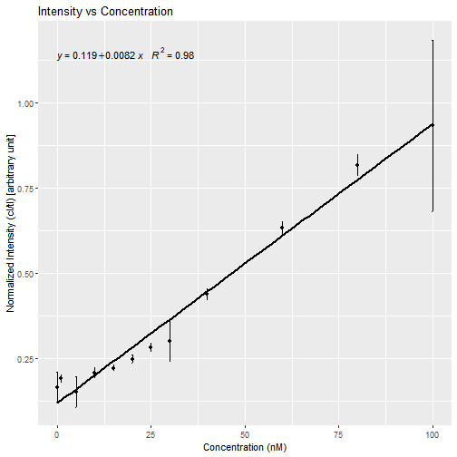
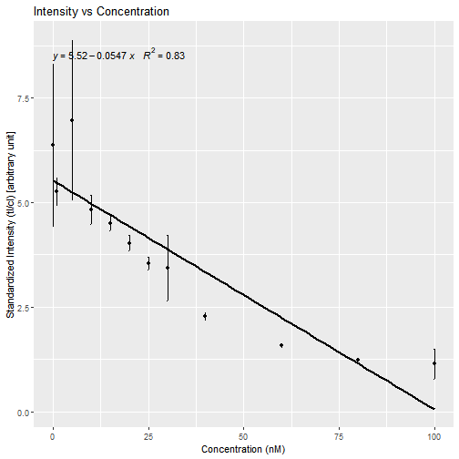

Analysis of the data of lateral flow assay

--------------------------------------------------------------------------

Date: 2018-11-29 19:32:47

-----------------------------------------

Initial Data:

-----------------------------------------

|Replicate |   Control|     Test| Conc|
|:---------|---------:|--------:|----:|
|R1        |  3.655782| 18.23130|    0|
|R1        |  2.723397| 15.03921|    1|
|R1        |  2.238912| 19.25371|    5|
|R2        |  3.249296| 16.32562|   10|
|R2        |  3.340175| 17.10187|   15|
|R2        |  3.008933| 16.99386|   20|
|R3        |  2.806054| 20.21449|   25|
|R3        |  3.629589| 17.90752|   30|
|R3        |  2.102740| 18.41913|   40|
|R4        |  3.405054| 17.68823|   60|
|R4        |  4.081180| 19.50425|   80|
|R4        |  4.078539| 18.41547|  100|
|R5        |  4.197044| 19.65837|   NA|
|R5        |  4.059418| 18.33676|   NA|
|R5        |  4.437953| 19.20935|   NA|
|R6        |  4.971660| 18.93552|   NA|
|R6        |  4.446953| 18.47677|   NA|
|R6        |  4.951368| 20.44071|   NA|
|R7        |  5.718853| 19.27906|   NA|
|R7        |  5.731489| 20.85752|   NA|
|R7        |  6.069196| 22.00054|   NA|
|R8        |  8.272924| 24.29020|   NA|
|R8        |  5.319196| 23.12944|   NA|
|R8        |  5.757125| 17.42850|   NA|
|R9        |  9.160681| 20.03211|   NA|
|R9        |  8.568974| 19.74645|   NA|
|R9        |  9.643167| 22.69484|   NA|
|R10       | 15.171359| 23.87086|   NA|
|R10       | 15.102894| 23.21654|   NA|
|R10       | 14.302702| 23.22196|   NA|
|R11       | 17.204823| 21.00291|   NA|
|R11       | 16.489409| 21.02323|   NA|
|R11       | 18.676359| 22.04011|   NA|
|R12       | 21.782673| 19.89194|   NA|
|R12       | 15.729409| 24.47032|   NA|
|R12       | 20.421966| 19.25157|   NA|

Combined replicates:

-----------------------------------------

|    |   NI.crep|  SI.crep|   NI.sdns|   SI.sdns|     NI.sd|     SI.sd| Concn|
|:---|---------:|--------:|---------:|---------:|---------:|---------:|-----:|
|R1  | 0.1659645| 6.369595| 0.0441078| 1.9496828| 0.7201375| 2.1983646|     0|
|R2  | 0.1904670| 5.264070| 0.0117589| 0.3357500| 0.1711503| 0.4204692|     1|
|R3  | 0.1518866| 6.965743| 0.0456872| 1.9239974| 0.7642129| 1.2115543|     5|
|R4  | 0.2077410| 4.829661| 0.0145433| 0.3425561| 0.3896014| 0.9139887|    10|
|R5  | 0.2219704| 4.509793| 0.0087807| 0.1778300| 0.1916015| 0.6720202|    15|
|R6  | 0.2484887| 4.030638| 0.0122085| 0.1926719| 0.2972551| 1.0273880|    20|
|R7  | 0.2824312| 3.545068| 0.0123130| 0.1507916| 0.1987234| 1.3665367|    25|
|R8  | 0.3002967| 3.437232| 0.0611159| 0.7903209| 1.5940272| 3.6726693|    30|
|R9  | 0.4387186| 2.281541| 0.0167152| 0.0856780| 0.5380211| 1.6260737|    40|
|R10 | 0.6339986| 1.578082| 0.0173578| 0.0433794| 0.4829699| 0.3762146|    60|
|R11 | 0.8169623| 1.225273| 0.0315767| 0.0475840| 1.1150475| 0.5930489|    80|
|R12 | 0.9328802| 1.137198| 0.2518040| 0.3627374| 3.1757839| 2.8462553|   100|

Normalized Intensity Plot (Standardized Intensity vs Concentration):
-------------------------------------------------------------------------

Standardized Intensity Plot (Normalized Intensity vs Concentration):
-------------------------------------------------------------------------

95% Confidence Interval:

------------------------------------------------------------------------------------

| Min.Value| Max.Value|
|---------:|---------:|
| 0.2283117| 0.5369893|
| 2.6426789| 4.8863038|

95% Confidence Interval:

------------------------------------------------------------------------------------

| Min.Value| Max.Value|
|---------:|---------:|
| 0.2283117| 0.5369893|
| 2.6426789| 4.8863038|

Correlation:

------------------------------------------------------------------------------------

|   NI_cor|    SI_cor|
|--------:|---------:|
| 0.989628| 0.9088938|

LOD_First Method:

------------------------------------------------------------------------------------

|    lod_ni|    loq_ni|  lod_si|   loq_si|
|---------:|---------:|-------:|--------:|
| 0.2982879| 0.6070426| 2.22541| 4.764572|

LOD_Second Method:

------------------------------------------------------------------------------------

|    lob_ni|    lod_ni|    loq_ni|   lob_si|   lod_si|   loq_si|
|---------:|---------:|---------:|--------:|--------:|--------:|
| 0.2385218| 0.2578652| 0.6070426| 1.733901| 1.812177| 4.764572|

Calculated Concentration:

------------------------------------------------------------------------------------

|  x|
|--:|
|  0|

Settings used during implementation:

--------------------------------------------

Select the type of file:  .txt 

Intensity value:  1 

Slope value:  1 

Intercept value:  1 

Session Information:

--------------------------------------------

R version 3.5.1 (2018-07-02)
Platform: x86_64-w64-mingw32/x64 (64-bit)
Running under: Windows >= 8 x64 (build 9200)

Matrix products: default

locale:
[1] LC_COLLATE=English_Germany.1252  LC_CTYPE=English_Germany.1252   
[3] LC_MONETARY=English_Germany.1252 LC_NUMERIC=C                    
[5] LC_TIME=English_Germany.1252    

attached base packages:
character(0)

other attached packages:
[1] GNSplex_0.1.0

loaded via a namespace (and not attached):
 [1] tidyselect_0.2.4    locfit_1.5-9.1      purrr_0.2.5        
 [4] lattice_0.20-35     colorspace_1.3-2    htmltools_0.3.6    
 [7] yaml_2.2.0          grDevices_3.5.1     rlang_0.2.2        
[10] pillar_1.3.0        later_0.7.5         glue_1.3.0         
[13] withr_2.1.2         EBImage_4.22.1      BiocGenerics_0.26.0
[16] RColorBrewer_1.1-2  bindrcpp_0.2.2      jpeg_0.1-8         
[19] bindr_0.1.1         plyr_1.8.4          stringr_1.3.1      
[22] munsell_0.5.0       gtable_0.2.0        htmlwidgets_1.2    
[25] evaluate_0.11       labeling_0.3        Biobase_2.40.0     
[28] knitr_1.20          httpuv_1.4.5        parallel_3.5.1     
[31] markdown_0.8        highr_0.7           methods_3.5.1      
[34] Rcpp_0.12.18        xtable_1.8-3        polynom_1.3-9      
[37] ggpmisc_0.3.0       scales_1.0.0        promises_1.0.1     
[40] jsonlite_1.5        abind_1.4-5         mime_0.5           
[43] ggplot2_3.0.0       stats_3.5.1         datasets_3.5.1     
[46] graphics_3.5.1      png_0.1-7           digest_0.6.17      
[49] stringi_1.1.7       tiff_0.1-5          dplyr_0.7.6        
[52] shiny_1.1.0         grid_3.5.1          tools_3.5.1        
[55] bitops_1.0-6        magrittr_1.5        lazyeval_0.2.1     
[58] RCurl_1.95-4.11     tibble_1.4.2        crayon_1.3.4       
[61] pkgconfig_2.0.2     utils_3.5.1         assertthat_0.2.0   
[64] base_3.5.1          rstudioapi_0.7      R6_2.2.2           
[67] fftwtools_0.9-8     compiler_3.5.1     
